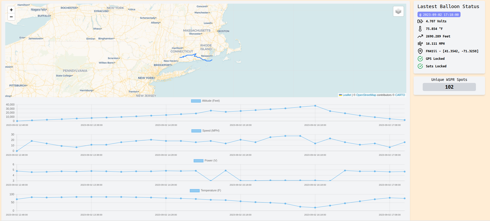
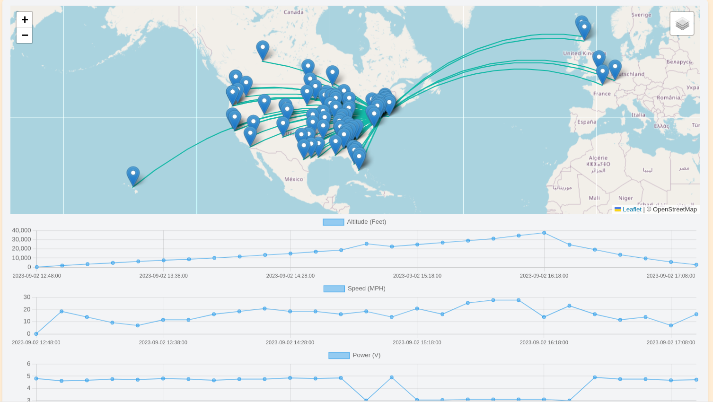

# u4b.live

U4B.live is a tool for monitoring real-time high altitude balloons that use the U4B balloon tracker
boards from QRPLabs. The site enables users to view the path traveled(fig. 1), the current and historical
telemetry (fig. 2), and unique WSPR spots for a balloon.
Although U4B.live was created specifically for Meriden Amateur Radio Club/Wallingford
Radio Group’s(MARC/WARG) high altitude balloon project, it was designed such that anybody can
track any balloon (provided on the balloon is using a U4B board). If a user supplies the proper
information for the balloon of interest, U4B.live will find all of the data broadcast up to the
current time and continue monitoring and updating the data shown on the dashboard as it becomes
available. 

